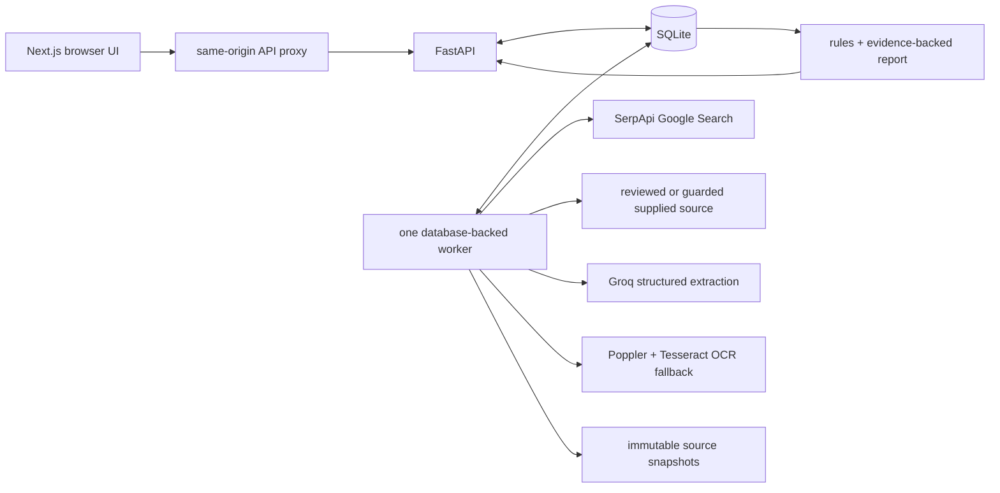

<h1 align="center">Kabtak</h1>

<p align="center"><strong>Scholarship deadlines, with proof</strong></p>

<p align="center">Local-first · evidence-backed · built for students</p>

<p align="center">
  <a href="#demo">Demo</a> ·
  <a href="#what-kabtak-does">Features</a> ·
  <a href="#quick-start">Quick start</a> ·
  <a href="#architecture">Architecture</a> ·
  <a href="#evaluation">Evaluation</a> ·
  <a href="#documentation">Documentation</a>
</p>

Kabtak helps a student find the deadline that applies **to the student**, without
confusing it with a college, district, or administrative verification date. It
searches reviewed official sources, preserves the source material, extracts
structured facts, applies deterministic rules, and shows the exact passage behind
each conclusion.

This repository is a submission for the **SerpApi India Hackathon 2026** in the
**Knowledge & Public Interest** track.

> Kabtak is an evidence-reading aid, not an official scholarship portal. A future
> deadline does not prove that a portal is open, and a supported condition does not
> guarantee eligibility or an award. Always confirm on the linked official source.

## What Kabtak does

- Finds reviewed official scholarship notices with bounded SerpApi searches.
- Separates student submission dates from institute, district, and administrative
  verification dates.
- Preserves source snapshots and exposes the exact passage behind every result.
- Uses Groq for schema-constrained extraction, then deterministic code for the
  actual deadline and eligibility decision.
- Handles conflicts and missing evidence explicitly instead of guessing.
- Keeps checks and optional profiles local, with immutable run history and
  user-controlled retention.
- Includes an offline historical replay that needs no API keys or worker.
- Analyses one student-supplied official notice link with guarded retrieval and
  an explicit unresolved result when publisher authority cannot be established.
- Uses bounded local OCR for scanned English PDFs and marks OCR-derived reports
  partial with an explicit recognition warning.
- Offers a deterministic Hindi summary without translating or replacing the
  original evidence, plus `.ics` export for supported student deadlines only.

## Available workflows

| Workflow | UI | Worker | SerpApi | Groq | Purpose |
| --- | --- | --- | --- | --- | --- |
| Reviewed catalogue check | `/` | Required | Required | Required | Searches reviewed official publishers and checks the selected programme and cycle. |
| Official-link check | `/link-check` | Required | Not used | Required | Analyses one student-supplied public notice with guarded retrieval. |
| Historical replay | `/examples` | Not required | Not used | Not used | Replays packaged evidence at a frozen reference time. |

Completed reports are available at `/checks/{check_id}`. They include the selected
student deadline, separated non-student dates, exact evidence receipts, limitations,
history, Hindi explanation, and calendar export when the result supports it.

## Demo

- [Watch the working demo on YouTube](https://www.youtube.com/watch?v=QK3M5dc2Ukk)
- [Run the same offline replay yourself](run.md#offline-example-without-api-usage)

> **Disclosure:** The voice used in the demo video is AI-generated.

The working demo recording and its upload notes are kept locally in the ignored
`kabtak/demo/` directory and are not included in this repository.

The recording opens the packaged historical example, runs the current decision
rules locally, and inspects its preserved evidence receipt. The live workflow uses
the same report and evidence UI, with SerpApi discovery and Groq extraction added
before the deterministic decision step.

## Why the search step matters

Scholarship notices are often split across a scheme page, a dated press release,
and a later extension. Kabtak uses the SerpApi Google Search API as the discovery
layer for reviewed-catalogue checks:

1. It runs a bounded set of deadline and amendment queries.
2. Search is restricted to reviewed official publisher domains and the requested
   programme and academic cycle.
3. Candidate results must contain programme, cycle, and deadline intent before
   they can be fetched.
4. The chosen search request, safe parameters, provider result identifier, result
   time, and selected URLs are retained with the run.
5. The actual documents are downloaded and checked; a search snippet is never
   treated as evidence.

This is a material dependency of the live path: SerpApi finds the official notice
or amendment that contributes source content to the final report. A reviewed
cycle-specific URL is used only as an explicitly recorded fallback when search
returns no qualifying result.

## Current scope

The public live workflow supports five reviewed programmes:

- National Means-cum-Merit Scholarship Scheme (NMMSS)
- PM-USP Central Sector Scheme of Scholarship
- National Overseas Scholarship
- AICTE Pragati Scholarship
- National Fellowship and Scholarship for Higher Education of ST Students

Each programme has documented cycles, application types, reviewed source policies,
bounded SerpApi discovery, and policy-checked fallback sources. Azim Premji
Scholarship remains deferred because stable direct retrieval was not available.
The catalogue workflow accepts allowlisted HTML and PDF sources. The separate
link workflow checks one direct public HTML or PDF source; it does not perform
unrestricted crawling, portal login, or application submission.

### Any scholarship from an official link

A guarded mode lets a student provide an official notice link for a scholarship
outside the catalogue. Kabtak validates the public URL, retrieves it with strict redirect,
size, format, and request limits, extracts scoped facts, and returns the same cited
report. If authority, cycle, deadline role, or evidence cannot be established, the
output is explicitly unresolved or unsupported rather than guessed. The one-source
mode does not use SerpApi and clearly warns that it has not searched for amendments.

### Scanned-PDF OCR

When a PDF contains no extractable text, the worker can render at most the configured
page limit and run local English Tesseract OCR. OCR blocks retain their page number
and engine metadata; reports remain partial and warn that recognition errors are
possible. Text PDFs stay on the normal parser path. OCR is controlled by
`OCR_ENABLED`, `OCR_TIMEOUT_SECONDS`, and `MAX_OCR_PAGES` in `kabtak/.env`.

### Hindi report explanation

A finished report can show a code-controlled Hindi explanation of its conclusion,
deadline timing, application type, coverage, and known safety limitations. The
original evidence and source-specific text are never machine-translated or replaced;
unknown limitations remain identified and the original English list stays visible.

### Calendar export

A `.ics` download is offered only when deterministic rules select a supported student
deadline. Date-only and uncertain-timezone deadlines become inclusive all-day events.
Source-backed UTC and Asia/Kolkata times are exported as exact UTC instants. Conflicting
or insufficient results never expose the calendar action, and every event asks the
student to confirm the date on the cited official source.

## Architecture



The API accepts and persists a check quickly, returning a queued run instead of keeping
one HTTP request open during network and model work. A separate Python worker claims
one queued run, records heartbeats and progress, performs bounded discovery, guarded
retrieval, HTML/PDF parsing and optional OCR, invokes structured extraction, validates
every evidence reference, applies deterministic deadline and eligibility rules, and
commits the report. Refresh creates a new immutable run rather than overwriting history.
Only one worker should run against the local SQLite database. If it is stopped, live
and official-link checks remain queued; saved reports and packaged replays still work.

The local application has three processes:

- Next.js 16 and React 19 for the responsive UI and server-only API proxy
- FastAPI, Pydantic, SQLAlchemy, and Alembic for validation and persistence
- A Python worker using HTTPX, Beautiful Soup, pdfplumber, Poppler/Tesseract,
  SerpApi, and Groq

See [the detailed system design](docs/system-design.md) for schemas, state
transitions, trust boundaries, and failure behavior.

## Quick start

Requirements: Python 3.12, `uv`, Node.js 20.12 or newer, and pnpm 12. Scanned-PDF
OCR additionally needs Poppler (`pdftoppm`) and Tesseract with English language data.
The offline historical replay needs no provider keys. Catalogue checks need SerpApi
and Groq keys; official-link checks need Groq but do not use SerpApi.

Install the OCR executables on Fedora with:

```bash
sudo dnf install poppler-utils tesseract
```

On Ubuntu or Debian:

```bash
sudo apt install poppler-utils tesseract-ocr
```

```bash
cd kabtak
cp --no-clobber .env.example .env
openssl rand -hex 32
```

Put the generated value in `INTERNAL_API_TOKEN` inside `kabtak/.env`. The file is
split into clearly labelled shared, frontend-only, and backend/worker-only
sections. Add SerpApi and Groq keys only when you want to run live discovery.

```bash
cd backend
uv sync --dev
uv run alembic upgrade head
```

```bash
cd ../frontend
pnpm install --frozen-lockfile
pnpm generate:api
pnpm exec playwright install chromium
```

Both FastAPI and Next.js now load the same `kabtak/.env`; no duplicated token is
required. For catalogue checks, set `SERPAPI_API_KEY`, `LLM_PROVIDER=groq`,
`LLM_MODEL=openai/gpt-oss-120b`, and `LLM_API_KEY`. Official-link checks use the
same LLM settings but do not require `SERPAPI_API_KEY`. Then run the API, worker,
and frontend in separate terminals as documented in [run.md](run.md).

Open <http://127.0.0.1:3000/examples> and select **Open offline replay** for a
credential-free test. The replay is visibly marked historical and uses a frozen
reference time; it cannot be mistaken for a current opportunity.

## Verification

```bash
cd kabtak/backend
uv run pytest
uv run ruff check app tests scripts migrations
uv run ruff format --check app tests scripts migrations

cd ../frontend
pnpm lint
pnpm typecheck
pnpm build
pnpm test:e2e

cd ../backend
uv run python ../evaluation/phase5/run_evaluation.py --mode all --offline
uv run pytest ../evaluation/phase5/tests
```

The release audit also installs and runs the project from a temporary clean Git
checkout. See [the release checklist](docs/release-checklist.md) for the recorded
result and [run.md](run.md) for all commands.

The browser suite covers the reviewed catalogue, official-link intake, offline replay,
save/refresh/delete lifecycle, evidence inspection, Hindi supported/conflicting/
insufficient states, OCR limitation messaging, all-day calendar output, exact UTC and
Asia/Kolkata times, and safe fallback when a published time has no verified timezone.

## Evaluation

The frozen Phase 5 set contains 20 real-notice questions across five programmes,
four government publishers, HTML and PDF passages, amendments, conflicts, missing
dates, actor separation, and synthetic eligibility profiles. The final system
numbers are explicitly a **held-out-informed regression result** because failures
in the held-out split informed parser and prompt fixes.

| Path | Correct | Incorrect | Correctly unresolved | Failed | Ground-truth matches |
| --- | ---: | ---: | ---: | ---: | ---: |
| Kabtak system | 17 | 0 | 3 | 0 | 20/20 |
| Single-prompt baseline | 8 | 3 | 7 | 2 | 11/20 |

All 20 system cases passed citation-reference and date-in-passage checks, followed
by manual support review. The full method, token use, fixes, and caveats are in the
[Phase 5 evaluation report](kabtak/evaluation/phase5/report.md). Committed outputs
can be reproduced offline without SerpApi or Groq calls.

## Important limitations

- Catalogue search is intentionally limited to the five reviewed programmes listed
  above. Link mode checks only the supplied source and may leave publisher authority unresolved.
- Search cannot guarantee that every official amendment is indexed.
- The evaluation measures 20 bounded questions over seven documents, not universal
  scholarship accuracy or live rediscovery.
- The held-out result is a regression result, not an untouched estimate.
- OCR currently reads English scanned PDFs only, is limited to 10 pages by default,
  and can make recognition mistakes; its output is never presented as full coverage.
- The Hindi panel explains structured report fields; it does not translate the
  source evidence or resolve language-dependent ambiguity in a notice.
- Calendar export is available only after a student deadline is resolved as supported;
  a time without a verified timezone is deliberately exported as an all-day event.
- Groq free-tier rate limits can make live runtime nondeterministic.
- Data is stored locally in SQLite; this prototype has no accounts or public
  multi-user deployment controls.
- Eligibility checks cover only explicitly supported rules. Missing or complex
  conditions remain visible as unknown.

## Privacy and repository safety

Profiles, database files, downloaded source snapshots, logs, provider keys, local
environment files, coverage output, and browser artifacts are excluded by
`kabtak/.gitignore`. The committed `kabtak/.env.example` contains placeholders and
comments only; `kabtak/.env` is ignored. The committed fixtures contain bounded
public-source passages and synthetic profiles only. Before publishing, run the
audit commands in [run.md](run.md#stop-the-project) and review `git status`.

## AI use disclosure

- **OpenAI Codex** assisted with architecture review, implementation, tests,
  debugging, evaluation tooling, and documentation. The developer remains
  responsible for reviewing and submitting the result.
- **Groq-hosted `openai/gpt-oss-120b`** is the configured runtime model for
  structured fact extraction and was also used for the measured baseline.
  Deterministic code—not free-form model prose—selects the final deadline and
  eligibility result.

## Documentation

- `kabtak/frontend/` — Next.js application and Playwright tests
- `kabtak/backend/` — FastAPI application, worker, migrations, and pytest suite
- `kabtak/.env.example` — single annotated configuration template for both apps
- `kabtak/config/programmes/` — reviewed programme/source policies
- `kabtak/examples/` — safe offline historical replay fixtures
- `kabtak/evaluation/` — development probes and measured Phase 5 evaluation
- `docs/system-design.md` — technical source of truth
- `run.md` — complete local setup, run, test, and troubleshooting guide
- `docs/submission-draft.md` — copy-ready submission content and owner-only fields

## Project status

Phases 0–6 in [plan.md](plan.md) are implemented for the bounded prototype. All
five reviewed programmes use the same search, retrieval, extraction, decision,
evidence, failure, and history pipeline. Guarded official-link analysis, scanned-PDF
OCR, Hindi report explanations, and safe calendar export are implemented expansions.
Public repository/video verification and authenticated submission remain
participant-only release steps.

## Contributing and responsible use

Keep changes evidence-first: add or update programme policy, fixtures, tests, and
evaluation cases together. Never commit credentials, applicant data, generated
databases, or downloaded runtime snapshots. This prototype is not an official
government service and must not be presented as one.
