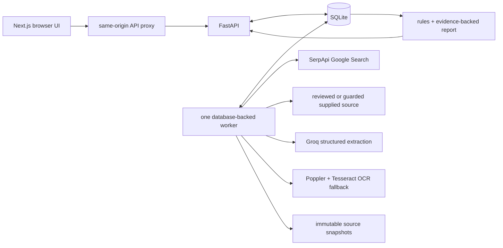

<h1 align="center">Kabtak</h1>

<p align="center"><strong>Scholarship deadlines, with proof</strong></p>

<p align="center">Local-first · evidence-backed · built for students</p>

<p align="center">
  <a href="#demo">Demo</a> ·
  <a href="#what-kabtak-does">Features</a> ·
  <a href="#quick-start">Quick start</a> ·
  <a href="#run-the-application">Run</a> ·
  <a href="#architecture">Architecture</a> ·
  <a href="#how-decisions-and-evidence-work">Decision model</a> ·
  <a href="#evaluation">Evaluation</a> ·
  <a href="#documentation">Documentation</a>
</p>

Kabtak helps a student find the deadline that applies **to the student**, without
confusing it with a college, district, or administrative verification date. It
searches reviewed official sources, preserves the source material, extracts
structured facts, applies deterministic rules, and shows the exact passage behind
each conclusion.

This repository is a submission for the **SerpApi India Hackathon 2026** in the
**Knowledge & Public Interest** track.

> Kabtak is an evidence-reading aid, not an official scholarship portal. A future
> deadline does not prove that a portal is open, and a supported condition does not
> guarantee eligibility or an award. Always confirm on the linked official source.

## What Kabtak does

- Finds reviewed official scholarship notices with bounded SerpApi searches.
- Separates student submission dates from institute, district, and administrative
  verification dates.
- Preserves source snapshots and exposes the exact passage behind every result.
- Uses Groq for schema-constrained extraction, then deterministic code for the
  actual deadline and eligibility decision.
- Handles conflicts and missing evidence explicitly instead of guessing.
- Keeps checks and optional profiles local, with immutable run history and
  user-controlled retention.
- Includes an offline historical replay that needs no API keys or worker.
- Analyses one student-supplied official notice link with guarded retrieval and
  an explicit unresolved result when publisher authority cannot be established.
- Uses bounded local OCR for scanned English PDFs and marks OCR-derived reports
  partial with an explicit recognition warning.
- Offers a deterministic Hindi summary without translating or replacing the
  original evidence, plus `.ics` export for supported student deadlines only.

## Available workflows

| Workflow | UI | Worker | SerpApi | Groq | Purpose |
| --- | --- | --- | --- | --- | --- |
| Reviewed catalogue check | `/` | Required | Required | Required | Searches reviewed official publishers and checks the selected programme and cycle. |
| Official-link check | `/link-check` | Required | Not used | Required | Analyses one student-supplied public notice with guarded retrieval. |
| Historical replay | `/examples` | Not required | Not used | Not used | Replays packaged evidence at a frozen reference time. |

Completed reports are available at `/checks/{check_id}`. They include the selected
student deadline, separated non-student dates, exact evidence receipts, limitations,
history, Hindi explanation, and calendar export when the result supports it.

## Demo

- [Watch the working demo on YouTube](https://www.youtube.com/watch?v=QK3M5dc2Ukk)
- [Run the same offline replay yourself](#offline-replay-without-api-usage)

> **Disclosure:** The voice used in the demo video is AI-generated.

The working demo recording and its upload notes are kept locally in the ignored
`kabtak/demo/` directory and are not included in this repository.

The recording opens the packaged historical example, runs the current decision
rules locally, and inspects its preserved evidence receipt. The live workflow uses
the same report and evidence UI, with SerpApi discovery and Groq extraction added
before the deterministic decision step.

## Why the search step matters

Scholarship notices are often split across a scheme page, a dated press release,
and a later extension. Kabtak uses the SerpApi Google Search API as the discovery
layer for reviewed-catalogue checks:

1. It runs a bounded set of deadline and amendment queries.
2. Search is restricted to reviewed official publisher domains and the requested
   programme and academic cycle.
3. Candidate results must contain programme, cycle, and deadline intent before
   they can be fetched.
4. The chosen search request, safe parameters, provider result identifier, result
   time, and selected URLs are retained with the run.
5. The actual documents are downloaded and checked; a search snippet is never
   treated as evidence.

This is a material dependency of the live path: SerpApi finds the official notice
or amendment that contributes source content to the final report. A reviewed
cycle-specific URL is used only as an explicitly recorded fallback when search
returns no qualifying result.

## Current scope

The public live workflow supports five reviewed programmes:

- National Means-cum-Merit Scholarship Scheme (NMMSS)
- PM-USP Central Sector Scheme of Scholarship
- National Overseas Scholarship
- AICTE Pragati Scholarship
- National Fellowship and Scholarship for Higher Education of ST Students

Each programme has documented cycles, application types, reviewed source policies,
bounded SerpApi discovery, and policy-checked fallback sources. Azim Premji
Scholarship remains deferred because stable direct retrieval was not available.
The catalogue workflow accepts allowlisted HTML and PDF sources. The separate
link workflow checks one direct public HTML or PDF source; it does not perform
unrestricted crawling, portal login, or application submission.

### Any scholarship from an official link

A guarded mode lets a student provide an official notice link for a scholarship
outside the catalogue. Kabtak validates the public URL, retrieves it with strict redirect,
size, format, and request limits, extracts scoped facts, and returns the same cited
report. If authority, cycle, deadline role, or evidence cannot be established, the
output is explicitly unresolved or unsupported rather than guessed. The one-source
mode does not use SerpApi and clearly warns that it has not searched for amendments.

### Scanned-PDF OCR

When a PDF contains no extractable text, the worker can render at most the configured
page limit and run local English Tesseract OCR. OCR blocks retain their page number
and engine metadata; reports remain partial and warn that recognition errors are
possible. Text PDFs stay on the normal parser path. OCR is controlled by
`OCR_ENABLED`, `OCR_TIMEOUT_SECONDS`, and `MAX_OCR_PAGES` in `kabtak/.env`.

### Hindi report explanation

A finished report can show a code-controlled Hindi explanation of its conclusion,
deadline timing, application type, coverage, and known safety limitations. The
original evidence and source-specific text are never machine-translated or replaced;
unknown limitations remain identified and the original English list stays visible.

### Calendar export

A `.ics` download is offered only when deterministic rules select a supported student
deadline. Date-only and uncertain-timezone deadlines become inclusive all-day events.
Source-backed UTC and Asia/Kolkata times are exported as exact UTC instants. Conflicting
or insufficient results never expose the calendar action, and every event asks the
student to confirm the date on the cited official source.

## Architecture



The API accepts and persists a check quickly, returning a queued run instead of keeping
one HTTP request open during network and model work. A separate Python worker claims
one queued run, records heartbeats and progress, performs bounded discovery, guarded
retrieval, HTML/PDF parsing and optional OCR, invokes structured extraction, validates
every evidence reference, applies deterministic deadline and eligibility rules, and
commits the report. Refresh creates a new immutable run rather than overwriting history.
Only one worker should run against the local SQLite database. If it is stopped, live
and official-link checks remain queued; saved reports and packaged replays still work.

The local application has three processes:

- Next.js 16 and React 19 for the responsive UI and server-only API proxy
- FastAPI, Pydantic, SQLAlchemy, and Alembic for validation and persistence
- A Python worker using HTTPX, Beautiful Soup, pdfplumber, Poppler/Tesseract,
  SerpApi, and Groq

### Request lifecycle

1. Next.js submits a validated check through its same-origin API proxy.
2. FastAPI creates the check and a queued run in a short database transaction.
3. The worker claims the run, searches, retrieves and parses bounded source material,
   extracts candidate facts, validates their evidence references, and applies rules.
4. The worker atomically stores an immutable report and terminal run state.
5. The browser polls status and then renders the report and its evidence receipts.

A browser refresh or closed tab does not cancel a run. Worker heartbeats allow abandoned
work to become explicitly interrupted, and a retry creates a new run rather than editing
the old one. SQLite is intentionally used for one local writer; this is not a distributed
or public multi-user architecture.

## How decisions and evidence work

Kabtak compares facts only after matching programme, academic cycle, applicant group,
application type, actor, and action. An institute verification date therefore cannot
replace a student submission date, and a newer notice does not supersede an older one
unless an authorized amendment establishes the same scope.

The deadline rules behave conservatively:

- one supported student-submission date is reported with its evidence;
- an explicit same-scope amendment may replace an earlier date while preserving both;
- different actors or actions remain separate;
- unresolved disagreement becomes a conflict with no selected deadline; and
- missing cycle, actor, scope, or evidence produces an insufficient result rather than
  a guess.

Eligibility uses a closed set of deterministic comparisons and three-valued logic:
`true`, `false`, or `unknown`. Missing profile data, unsupported exceptions, and
unresolved conditions remain unknown. The UI says `meets_checked_conditions`,
`condition_not_met`, `more_information_needed`, or `not_assessed`; it never predicts
an award or turns a partial rule set into “you are eligible.” Profile values are used
locally by the rule engine and are not included in search queries or extraction prompts.

Downloaded source bytes and parsed blocks are content-addressed and retained as immutable
versions. Extracted facts must cite existing block IDs, and dates and values are checked
against their cited context before a report can be committed. Parser, model, prompt,
schema, and rules versions are recorded so an old report stays explainable after the
software changes.

Run state and answer quality are deliberately separate. A `completed` run may validly
report `supported`, `conflicting`, or `insufficient` evidence. `failed` and `interrupted`
describe processing failures, not scholarship conclusions.

## Quick start

Requirements: Python 3.12, `uv`, Node.js 20.12 or newer, and pnpm 12. Scanned-PDF
OCR additionally needs Poppler (`pdftoppm`) and Tesseract with English language data.
The offline historical replay needs no provider keys. Catalogue checks need SerpApi
and Groq keys; official-link checks need Groq but do not use SerpApi.

Install the OCR executables on Fedora with:

```bash
sudo dnf install poppler-utils tesseract
```

On Ubuntu or Debian:

```bash
sudo apt install poppler-utils tesseract-ocr
```

```bash
cd kabtak
cp --no-clobber .env.example .env
openssl rand -hex 32
```

Put the generated value and any provider credentials in `kabtak/.env`:

```dotenv
APP_ORIGIN=http://127.0.0.1:3000
INTERNAL_API_TOKEN=paste-the-generated-token-here
BACKEND_URL=http://127.0.0.1:8000
SERPAPI_API_KEY=paste-your-serpapi-key-here
LLM_PROVIDER=groq
LLM_MODEL=openai/gpt-oss-120b
LLM_API_KEY=paste-your-groq-key-here
```

The template is split into shared, frontend-server-only, and backend/worker-only
sections. Secrets have no `NEXT_PUBLIC_` prefix and never need to reach browser code.
Older `kabtak/backend/.env` and `kabtak/frontend/.env.local` files are supported as
migration overrides; remove them after copying their values to the shared file so they
cannot silently override the token or provider settings.

```bash
cd backend
uv sync --dev
uv run alembic upgrade head
```

```bash
cd ../frontend
pnpm install --frozen-lockfile
pnpm generate:api
pnpm exec playwright install chromium
```

Both FastAPI and Next.js now load the same `kabtak/.env`; no duplicated token is
required. For catalogue checks, set `SERPAPI_API_KEY`, `LLM_PROVIDER=groq`,
`LLM_MODEL=openai/gpt-oss-120b`, and `LLM_API_KEY`. Official-link checks use the
same LLM settings but do not require `SERPAPI_API_KEY`.

## Run the application

Keep these three processes running in separate terminals.

Terminal 1 — FastAPI:

```bash
cd kabtak/backend
uv run uvicorn app.main:app --host 127.0.0.1 --port 8000 --reload
```

Terminal 2 — worker:

```bash
cd kabtak/backend
uv run python -m app.worker
```

Terminal 3 — Next.js:

```bash
cd kabtak/frontend
pnpm dev
```

Open <http://127.0.0.1:3000>. Run only one worker against the local database.
The principal routes are:

| Route | Purpose |
| --- | --- |
| `/` | Start a reviewed catalogue check. |
| `/link-check` | Check one supplied official HTML or PDF notice. |
| `/discover` | Browse the local reviewed programme catalogue without using search credits. |
| `/saved` | View checks explicitly saved on this machine. |
| `/examples` | Run packaged historical replays without provider calls. |
| `/checks/{check_id}` | View progress, reports, evidence, actions, and immutable history. |

### Offline replay without API usage

Start FastAPI and Next.js, but no worker is required. Open
<http://127.0.0.1:3000/examples> and select **Open offline replay**. The replay uses
packaged evidence and the current deterministic rules without SerpApi, Groq, or source
site calls. It is visibly marked historical, uses a frozen reference time, and cannot
be mistaken for a current opportunity.

### Live smoke test

For a full provider-backed test, select NMMSS, academic year `2026-27`, application
type `Fresh`, and leave the optional notice URL empty. A successful run moves through
searching, fetching, extracting, checking, and finalizing. Inspect an evidence receipt
instead of relying on an old expected date if the official source has changed.

### API surface

Browser calls use `/api/v1/...` through Next.js; the corresponding FastAPI routes use
`/v1/...`. The main contracts are:

| Method and FastAPI route | Purpose |
| --- | --- |
| `GET /v1/health` | Database, worker-heartbeat, and live/replay readiness. |
| `GET /v1/programmes` | Reviewed local programme catalogue. |
| `POST /v1/checks` | Create a check and queued run. |
| `POST /v1/checks/link` | Create a guarded one-source link check. |
| `GET /v1/checks/{id}` | Check metadata and immutable run history. |
| `GET /v1/runs/{id}` | Current status, stage, timestamps, and safe errors. |
| `GET /v1/runs/{id}/report` | Stored report after successful processing. |
| `GET /v1/runs/{id}/evidence/{versionId}/{blockId}` | Verified cited passage. |
| `POST /v1/checks/{id}/refresh` | New live run with the same fixed check inputs. |
| `POST /v1/runs/{id}/retry` | New run linked to a failed or interrupted run. |
| `GET /v1/examples` / `POST /v1/examples/{id}/replay` | List or replay packaged examples. |

State-changing creation, refresh, retry, and replay requests use an idempotency key.
Repeating the same request returns the original work; reusing a key for different input
returns a conflict. Unsupported input is rejected before external work begins.

### Common startup problems

- `LIVE_INTEGRATIONS_DISABLED`: check both provider keys, `LLM_PROVIDER`, and
  `LLM_MODEL` in `kabtak/.env`.
- `UNAUTHORIZED` or proxy errors: remove or reconcile legacy environment files, then
  restart all three processes so the internal token matches.
- `ORIGIN_NOT_ALLOWED`: make `APP_ORIGIN` match the browser protocol and port, then
  restart Next.js. Localhost, `127.0.0.1`, and `[::1]` are treated as loopback hosts.
- Database-table errors: run `uv run alembic upgrade head` from `kabtak/backend`.
- Worker-lock errors: stop the other worker before starting a new one.
- A run remains queued: confirm the worker terminal is running and inspect
  <http://127.0.0.1:3000/api/v1/health> through the frontend proxy.

Stop each process with `Ctrl+C`.

## Verification

```bash
cd kabtak/backend
uv run pytest
uv run ruff check app tests scripts migrations
uv run ruff format --check app tests scripts migrations

cd ../frontend
pnpm lint
pnpm typecheck
pnpm build
pnpm test:e2e

cd ../backend
uv run python ../evaluation/phase5/run_evaluation.py --mode all --offline
uv run pytest ../evaluation/phase5/tests

cd ../evaluation
../backend/.venv/bin/pytest phase0/tests
```

The offline Phase 5 command uses committed outputs, makes no SerpApi or Groq calls,
and does not rewrite tracked result artifacts. Omitting `--offline` deliberately repeats
the rate-limited model comparison and may consume provider quota.

The recorded October 4, 2026 release audit installed both lockfiles in a temporary
clean Git checkout, migrated a fresh database, and passed 95 backend tests, 5 Phase 0
tests, 4 Phase 5 tests, 5 browser tests, Ruff, ESLint, TypeScript, and a production
frontend build. This is a dated audit record, not a substitute for rerunning the commands
above after changes.

The browser suite covers the reviewed catalogue, official-link intake, offline replay,
save/refresh/delete lifecycle, evidence inspection, Hindi supported/conflicting/
insufficient states, OCR limitation messaging, all-day calendar output, exact UTC and
Asia/Kolkata times, and safe fallback when a published time has no verified timezone.

Before committing, confirm that local secrets and runtime data remain ignored:

```bash
git check-ignore -v \
  kabtak/.env \
  kabtak/backend/.env \
  kabtak/frontend/.env.local \
  kabtak/data/kabtak.db \
  kabtak/data/sources/example.html

git status --short
git diff --cached --name-only
```

## Evaluation

The frozen Phase 5 set contains 20 real-notice questions across five programmes,
four government publishers, HTML and PDF passages, amendments, conflicts, missing
dates, actor separation, and synthetic eligibility profiles. The final system
numbers are explicitly a **held-out-informed regression result** because failures
in the held-out split informed parser and prompt fixes.

| Path | Correct | Incorrect | Correctly unresolved | Failed | Ground-truth matches |
| --- | ---: | ---: | ---: | ---: | ---: |
| Kabtak system | 17 | 0 | 3 | 0 | 20/20 |
| Single-prompt baseline | 8 | 3 | 7 | 2 | 11/20 |

All 20 system cases passed citation-reference and date-in-passage checks, followed
by manual support review. The full method, token use, fixes, and caveats are in the
[Phase 5 evaluation report](kabtak/evaluation/phase5/report.md). Committed outputs
can be reproduced offline without SerpApi or Groq calls.

## Important limitations

- Catalogue search is intentionally limited to the five reviewed programmes listed
  above. Link mode checks only the supplied source and may leave publisher authority unresolved.
- Search cannot guarantee that every official amendment is indexed.
- The evaluation measures 20 bounded questions over seven documents, not universal
  scholarship accuracy or live rediscovery.
- The held-out result is a regression result, not an untouched estimate.
- OCR currently reads English scanned PDFs only, is limited to 10 pages by default,
  and can make recognition mistakes; its output is never presented as full coverage.
- The Hindi panel explains structured report fields; it does not translate the
  source evidence or resolve language-dependent ambiguity in a notice.
- Calendar export is available only after a student deadline is resolved as supported;
  a time without a verified timezone is deliberately exported as an all-day event.
- Groq free-tier rate limits can make live runtime nondeterministic.
- Data is stored locally in SQLite; this prototype has no accounts or public
  multi-user deployment controls.
- Eligibility checks cover only explicitly supported rules. Missing or complex
  conditions remain visible as unknown.

## Privacy and repository safety

Profiles, database files, downloaded source snapshots, logs, provider keys, local
environment files, coverage output, and browser artifacts are excluded by
`kabtak/.gitignore`. The committed `kabtak/.env.example` contains placeholders and
comments only; `kabtak/.env` is ignored. The committed fixtures contain bounded
public-source passages and synthetic profiles only.

Unsaved checks are stored locally for 24 hours after their latest terminal run unless
the user saves them. Saving removes the expiry; deleting a terminal check removes its
profile-bearing inputs, reports, runs, and related private records. Shared public source
versions remain only while another retained report needs them. Profile values are never
placed in logs, idempotency keys, search queries, or source caches.

Retrieved URLs are limited by reviewed host/path policies in catalogue mode. Link mode
accepts only public HTTP(S) HTML or PDF targets and rejects embedded credentials, unsafe
ports and schemes, local/private/link-local destinations, risky redirects, unsupported
content, oversized responses, and exhausted request budgets. Remote source text is data,
not executable instructions, and remote HTML is never injected into the page.

These controls are for a loopback, single-user prototype. Public multi-user hosting would
require authenticated ownership and authorization on every check, report, and evidence
route, per-user quotas, HTTPS, session/CSRF controls, stronger operational isolation, and
a storage architecture designed for multiple instances.

## Documentation

- [`kabtak/frontend/`](kabtak/frontend/) — Next.js application, API proxy, and Playwright tests
- [`kabtak/backend/`](kabtak/backend/) — FastAPI application, worker, migrations, and pytest suite
- [`kabtak/.env.example`](kabtak/.env.example) — annotated shared configuration template
- [`kabtak/config/programmes/`](kabtak/config/programmes/) — reviewed programme and source policies
- [`kabtak/examples/`](kabtak/examples/) — safe offline historical replay fixtures
- [`kabtak/evaluation/`](kabtak/evaluation/) — development probes and measured evaluation
- [Phase 5 evaluation report](kabtak/evaluation/phase5/report.md) — method, results, fixes, and caveats

This root README intentionally contains the public setup, operating model, decision
rules, safety boundaries, verification record, and troubleshooting guidance needed by
a fresh-clone viewer. Local planning, submission notes, recordings, and owner-only
release checklists are not required to understand or run the tracked project.

## Contributing and responsible use

Keep changes evidence-first: add or update programme policy, fixtures, tests, and
evaluation cases together. Never commit credentials, applicant data, generated
databases, or downloaded runtime snapshots. This prototype is not an official
government service and must not be presented as one.
